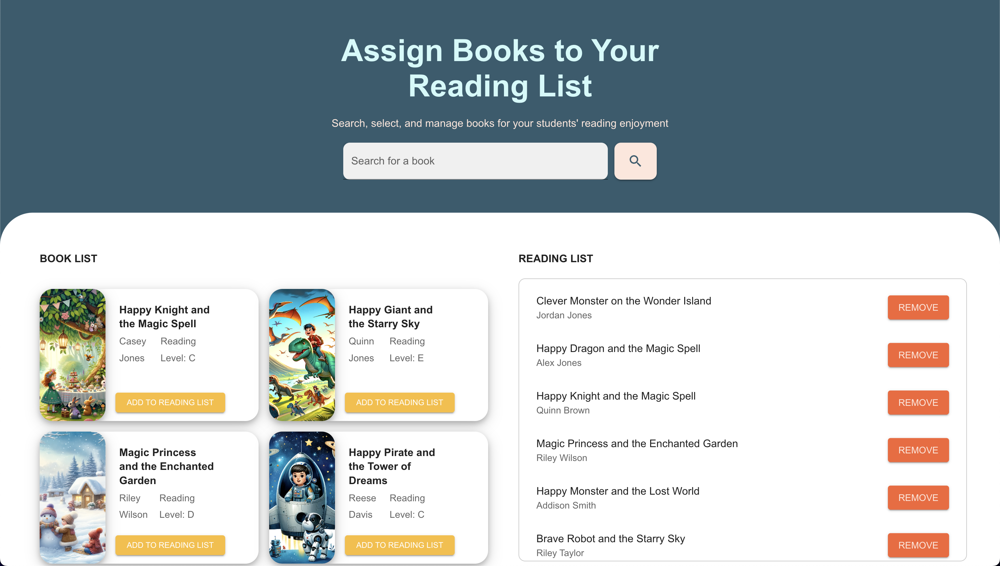

# Overview

The Book Assignment App allows educators to search, select, and assign books to their students' reading lists. It features responsive design and a user-friendly interface, utilizing Material-UI for styling and React for component management.

# Features

- Search for books using a search bar.
- Display a list of books.
- Add books to a reading list.
- Remove books from the reading list.
- Responsive design for different screen sizes.
- Pagination for managing long lists of books.

## Installation

Clone the repository:
```bash 
git clone https://github.com/penny-wanjiru/Ello.git
```
Install dependencies:
```bash
npm install
```

Start the development server:
```bash
npm start
```

Running the Backend:
The backend for this project provides the necessary book data. To run the backend server, follow these steps:
```bash
cd backend
npm install
npm start
```

Open [http://localhost:3000](http://localhost:3000) to view the app in your browser.
You should get a page like this:


## Usage
- Search Books: Use the search bar at the top to find books.
- Add to Reading List: Click the "Add to Reading List" button on any book card to add it to your reading list.
- Remove from Reading List: Click the "Remove" button next to any book in the reading list to remove it.

## Project Structure
- src/components: Contains all the React components (e.g., BookList, ReadingList, SearchBar, BookCard).
- src/theme: Custom Material-UI theme.
- src/App.tsx: Main application component.

